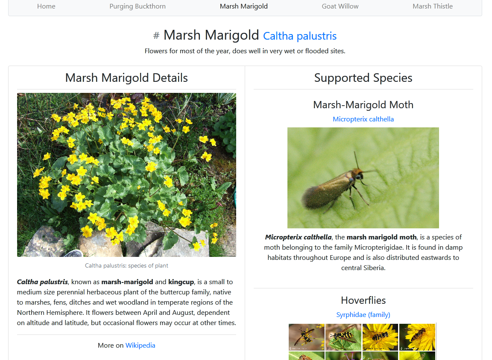

# Pact JS Demo
This is a general functional test automation demo for JavaScript digital services. The project has a provider service, which manages data about pollinator supporting plants (with a focus on the UK/northern Europe), and a consumer service which takes that data, enhances it with more data from Wikipedia, and renders the result in a responsive web GUI. The services communicate over HTTP and serve their results on `localhost`.

The automated tests operate a different levels, from unit to individual service e2e test to whole-of-product tests. The project includes a consumer driven contract testing (CDCT) demo using [Pact JS](https://github.com/pact-foundation/pact-js). See [below](#consumer-driven-contract-testing-with-pact-js) for more information.

---
Effectively the product takes this
```json
{
  "id": 2,
  "common_name": "Marsh Marigold",
  "species": "Caltha palustris",
  "perennial": true,
  "wikilink": "https://en.wikipedia.org/wiki/Caltha_palustris",
  "notes": "Flowers for most of the year, does well in very wet or flooded sites.",
  "supports": [
    {
      "common_name": "Marsh-Marigold Moth",
      "species": "Micropterix calthella",
      "wikilink": "https://en.wikipedia.org/wiki/Micropterix_calthella"
    },
    {
      "common_name": "Hoverflies",
      "species": "Syrphidae (family)",
      "wikilink": "https://en.wikipedia.org/wiki/Hoverfly"
    }
  ]
},
```

Decorates it with additional information from Wikipedia using the provided URLs, and turns it into this


---


## Project Structure
### The Consumer
The consumer is an Express [server-side web app](consumer). It takes data from the provider app, combines it with additional data from the [Wikipedia REST API](https://en.wikipedia.org/api/rest_v1/#/Page%20content), and renders it using [Handlebars](https://handlebarsjs.com/) templates into a responsive web GUI built with [Bootstrap](https://getbootstrap.com/) and a small amount of custom [jQuery](https://jquery.com/) logic (in line with the Bootstrap logic). HTTP calls within the app use the [Axios](https://github.com/axios/axios) library. The app includes unit and end-to-end tests and consumer driven contract tests built with [Pact](https://github.com/pact-foundation/pact-js), see [below](#testing) for more information.

### The Provider
The provider is an Express based [CRUD app in front of a data model](provider) and in-memory data store. The app includes unit and end-to-end tests and code to verify compliance with consumer driven [Pact](https://github.com/pact-foundation/pact-js) contracts, see [below](#testing) for more information.

### The Product Level Tests
Product level specifications verified against the system as a whole using Cucumber and WebDriver. See [the relevant README]('./product_tests') for more details.

---
## Usage
Everything is controlled from scripts in the [package.json](package.json). For script execution `yarn` can be replaced with `npm run`. The scripts are described in the relevant sections below, here is a summary.

| script                   | result                                                         |
| ---                      | ---                                                            |
| `test:unit:consumer`     | unit test the consumer                                         |
| `test:unit:provider`     | unit test the provider                                         |
| `test:unit:debug`        | unit test the consumer and provider with Node [listening for a debugging client](https://nodejs.org/en/docs/guides/debugging-getting-started/)  |
| `test:e2e:consumer`      | consumer end-to-end tests                                      |
| `test:e2e:provider`      | provider end-to-end tests                                      |
| `test:contract:consumer` | run consumer contract tests and create contracts (pact files)  |
| `test:contract:provider` | verify the contracts (pact files) against the provider         |
| `publish_pacts`          | publish the contracts (pact files) to a broker service         |
| `test:product`           | end-to-end tests of the product as a whole                     |
| `start`                  | start the services together                                    |
| `start:consumer`         | start the consumer and serve on `localhost`                    |
| `start:provider`         | start the provider and serve on `localhost`                    |

### Running
All processes are started with [Nodemon](https://github.com/remy/nodemon) and are configured to restart the relevant server file change.
 * `yarn start` Starts the whole system using [Concurrently](https://github.com/kimmobrunfeldt/concurrently).
 * `yarn start:consumer` Starts just the consumer.
 * `yarn start:provider` Starts just the provider.

### Testing
The primary purpose of automated testing is to rapidly and reproducibly measure when work is complete (when the system behaviour meets expectations). Work happens at many levels, from whole-of-product behaviour design to single component technical implementation to performance and security concerns, so automated testing happens at multiple levels of granularity, with different intent, different tools and different audiences for the feedback it provides on different timescales (milliseconds to tens of minutes). In general, the earlier in the development process a test can be run the faster its feedback can be used to correct mistakes before rework becomes necessary.

This also means that the tests often have different authors. Unit, integration and technical API tests should sit with engineers, who are also the main audience for those tests. Higher level tests such as product behaviour validation, can be a collaboration between most stakeholders, and communication of results should happen in formats and through channels appropriate to that broad audience.

As a secondary effect, the automated tests also check that the system does not unintentionally drift from expected behaviour.

Writing automated tests after development is "complete" misses most of the benefits of testing and leads to avoidable rework. Quality cannot be tested into a product, it needs to be built in from conception to realisation. For some testing, e.g. product level GUI tests, it is very hard to create the tests before implementation work begins, but it can and should be done in parallel and the work not considered complete until the automated validation is successful.

A complete automated test suite, covering the different levels and aspects of a digital product, is incredibly powerful and done well will hugely increase delivery velocity as part of a continuous integration process. However the majority of the digital products we create are ultimately for human use and so we will always need humans, sometimes engineers sometimes users, to validate the subject human experience that defines our products.

Non-functional concerns, such as product level performance and security, are specialist areas. Automation can be set up to catch some issues, but experts should be brought in to advise or audit. For product level performance, automated tests are only an approximation and focus should be given to log design and analysis to gain real world statistical insights.

#### A Note on Test Coverage
Test coverage is a very useful statistic at lower levels of testing, and less useful at higher levels of testing designed to validate the services a product provides rather than technical implementation. [See here](https://github.com/jimCresswell/e2e-web-test-framework-demo) for an example of test coverage driven by unit tests.

#### Unit Testing
Unit tests provide the fastest feedback (alongside automated syntax and style checking) when run locally on file change during development. This gives developers technical feedback while they are working on the problem and avoids the high mental cost of task switching.

They are also typically run as part of continuous integration, this can be especially important after code merges which have the potential to introduce syntax errors (and also unexpected emergent behaviour, but that is checked by higher-level test approaches).

`yarn test:unit` Provider and Consumer unit tests with [Mocha](https://mochajs.org) and [Chai](https://www.chaijs.com), asynchronous assertions are demonstrated in a variety of ways including [Chai-as-promised](https://github.com/domenic/chai-as-promised). Where a network interaction is tested HTTP calls and responses are mocked with [Axios Mock Adapter](https://github.com/ctimmerm/axios-mock-adapter).

The unit tests live with modules they test e.g. `my_module.js` will have a `my_module.test.js` in the same directory.

#### Consumer Driven Contract Testing (with Pact JS)
##### Consumer Side
 * `yarn test:contract:consumer` Generate the consumer contracts, this is where the actual tests exist.
 * `yarn publish_pacts` Publish the consumer contracts to a remote Pact broker.
See [here](./consumer/contract_test) for the code.

##### Provider Side
 * `yarn test:contract:provider` Get the remote contracts, verify them against the provider service, and publish the verification results back to the Pact broker. See <https://test.pact.dius.com.au/matrix/provider/Support%20Species%20App%20%28Provider%29/consumer/Species%20UI%20App%20%28Consumer%29>. These are tests in the sense that they validate provider behaviour, but only by exercising the expectations provided by the consumer through the published contract.
 See [here](./provider/contract_verification) for the code.

#### End to End API Testing of Isolated Services
These have a different intent from the contract tests. On the consumer side they test the whole consumer service rather than just the module that talks to the provider service. On the provider side they test all provider service end-points whereas the contract tests by design only test the interactions and returned payload data required by the consumer service.

##### Consumer
`yarn test:e2e:consumer` Consumer end-to-end API sanity test with [supertest](https://github.com/visionmedia/supertest). Where a network interaction is tested HTTP calls and responses are mocked with [Axios Mock Adapter](https://github.com/ctimmerm/axios-mock-adapter). Returned HTML is parsed with [Cheerio](https://github.com/cheeriojs/cheerio).  These tests are in the [consumer/e2e_test](consumer/e2e_test) directory.

##### Provider
`yarn test:e2e:provider` Provider end-to-end API sanity test with [supertest](https://github.com/visionmedia/supertest). These tests are in the [provider/e2e_test](provider/e2e_test) directory.

#### Product Level Testing
`yarn test:product` see [details here]('./product_tests').

---
## Potential Future Improvements
  * Configure a CI platform to hierarchically run the tests, fastest first bail on suite failure, and report to Github. See here for [an existing example with CI configuration](https://github.com/jimCresswell/e2e-web-test-framework-demo).
  * Add various status badges to the main README.
  * Deploy the services to cloud hosting and put a link in the Github page.
